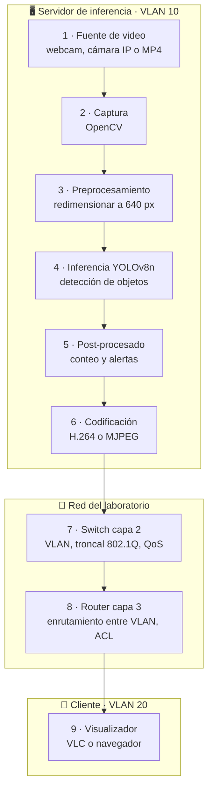
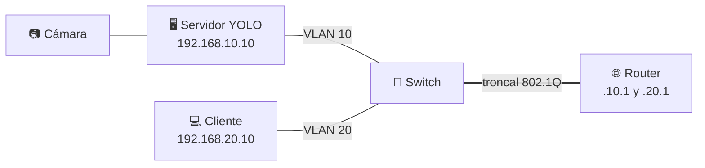
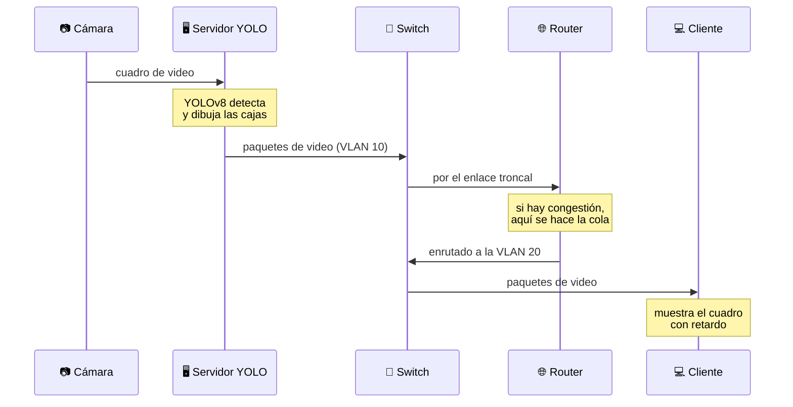
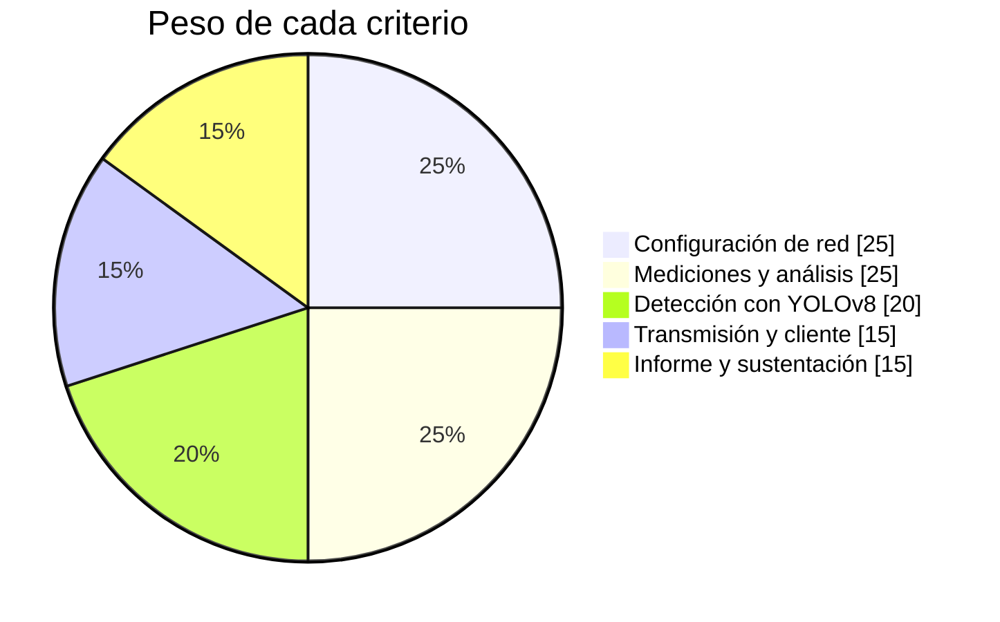

<div align="center">

# 📹 Proyecto 1 · Redes de Streaming con YOLOv8

### con conectividad a switch y router


### [▶️ Abrir la simulación](https://dialejobv.github.io/Proyectos_Productivos_SENA/#p1) · [⬅️ Volver al inicio](../README.md)

</div>

---

## 🎯 El reto

La institución quiere vigilar un espacio (la entrada, el parqueadero o el laboratorio) con una cámara. Tu equipo debe construir un sistema que:

1. Capture el video.
2. Detecte personas y objetos con **YOLOv8**.
3. Transmita el video con las detecciones por una red con **switch** y **router**.
4. Lo muestre en otro computador.

Y además debe **medir** qué pasa con el video cuando cambian la resolución, los FPS o la congestión de la red.

> [!IMPORTANT]
> **Pregunta del proyecto:** ¿Cómo influyen la configuración del video y de la red (VLAN, QoS) en la latencia y la pérdida de paquetes de un servicio de streaming con detección de objetos?

## 🧩 En palabras simples

<details>
<summary><b>¿Qué es streaming?</b></summary>

<br/>

Es enviar video poco a poco mientras se ve, sin esperar a descargar el archivo completo. El video se parte en **paquetes** que viajan por la red y se arman de nuevo en el destino.

</details>

<details>
<summary><b>¿Qué es YOLOv8?</b></summary>

<br/>

YOLO significa *You Only Look Once* (solo miras una vez). Es una red neuronal que mira la imagen **una sola vez** y dice qué objetos hay y dónde están. Por eso es tan rápida y sirve para video en vivo. Usaremos **YOLOv8n** (nano), la versión más liviana.

</details>

<details>
<summary><b>¿Qué hace el switch y qué hace el router?</b></summary>

<br/>

| Equipo | Capa OSI | Qué hace en este proyecto |
|---|:-:|---|
| **Switch** | 2 (enlace) | Conecta los equipos y los separa en **VLAN**: una para cámaras y servidor, otra para clientes |
| **Router** | 3 (red) | Permite que las VLAN se comuniquen entre sí y controla qué tráfico pasa |

</details>

<details>
<summary><b>¿Qué son latencia, ancho de banda y QoS?</b></summary>

<br/>

- **Latencia:** el tiempo entre que algo pasa frente a la cámara y se ve en la pantalla del cliente.
- **Ancho de banda:** la cantidad de datos por segundo que cabe en el enlace (Mbps).
- **QoS** (calidad de servicio): reglas para que el video tenga prioridad sobre otro tráfico cuando la red está llena.

</details>

## 🗺️ Arquitectura

Estos son los 9 bloques del proyecto. Los colores indican quién los hace: el **computador servidor**, la **red** o el **cliente**.



<details>
<summary><b>🔍 Ver cada bloque con su herramienta</b></summary>

<br/>

| # | Bloque | Herramienta | Nota |
|:-:|---|---|---|
| 1 | Fuente de video | Webcam USB, celular como cámara IP o archivo MP4 | Un MP4 fijo permite repetir los experimentos en las mismas condiciones |
| 2 | Captura | `cv2.VideoCapture` | FFmpeg solo si la fuente es RTSP |
| 3 | Preprocesamiento | Lo hace `ultralytics` | Se entiende el concepto, no se programa |
| 4 | Inferencia | `yolov8n.pt` preentrenado en COCO | Corre en la CPU de un portátil |
| 5 | Post-procesado | Conteo de personas, `model.track` | El NMS ya viene incluido |
| 6 | Codificación | Flask con MJPEG, o MediaMTX + FFmpeg | MJPEG es lo más fácil de montar |
| 7 | Switch | Cisco 2960 o Packet Tracer | VLAN 10, 20 y 99 |
| 8 | Router | Router-on-a-stick | Subinterfaces por VLAN y ACL |
| 9 | Cliente | VLC o navegador | Un reloj en pantalla ayuda a medir la latencia |

</details>

### La red



### El viaje de un cuadro de video



## 📏 ¿Cuánto pesa el video?

Cálculo aproximado con H.264 a 30 FPS. Compara estos valores con los que midas tú.

| Resolución | Píxeles por cuadro | Bitrate aproximado |
|---|--:|--:|
| 854 × 480 | 409 920 | 0,9 Mbps |
| 1280 × 720 | 921 600 | 1,9 Mbps |
| 1920 × 1080 | 2 073 600 | 4,4 Mbps |

> [!NOTE]
> Fórmula usada: `ancho × alto × FPS × 0,07 bits por píxel`. Es una estimación para aprender. El valor real depende de cuánto movimiento tenga la escena.

## 🚀 Primeros pasos

<details>
<summary><b>Paso 1 · Detectar objetos con la webcam</b></summary>

<br/>

```bash
pip install ultralytics opencv-python
```

```python
from ultralytics import YOLO
import cv2

model = YOLO("yolov8n.pt")          # se descarga solo la primera vez
cap = cv2.VideoCapture(0)           # 0 = webcam

while True:
    ok, frame = cap.read()
    if not ok:
        break
    r = model(frame, verbose=False)[0]
    personas = int((r.boxes.cls == 0).sum())   # clase 0 = persona
    out = r.plot()                              # dibuja las cajas
    cv2.putText(out, f"personas: {personas}", (10, 30),
                cv2.FONT_HERSHEY_SIMPLEX, 1, (0, 255, 0), 2)
    cv2.imshow("YOLOv8", out)
    if cv2.waitKey(1) == 27:                    # tecla Esc para salir
        break

cap.release()
cv2.destroyAllWindows()
```

</details>

<details>
<summary><b>Paso 2 · Configurar las VLAN en el switch</b></summary>

<br/>

```
enable
configure terminal
vlan 10
 name SERVIDOR
vlan 20
 name CLIENTES
interface fastEthernet 0/1
 switchport mode access
 switchport access vlan 10
interface fastEthernet 0/2
 switchport mode access
 switchport access vlan 20
interface gigabitEthernet 0/1
 switchport mode trunk
```

</details>

<details>
<summary><b>Paso 3 · Enrutar entre VLAN en el router</b></summary>

<br/>

```
enable
configure terminal
interface gigabitEthernet 0/0
 no shutdown
interface gigabitEthernet 0/0.10
 encapsulation dot1Q 10
 ip address 192.168.10.1 255.255.255.0
interface gigabitEthernet 0/0.20
 encapsulation dot1Q 20
 ip address 192.168.20.1 255.255.255.0
```

Prueba desde el cliente: `ping 192.168.10.10`

</details>

## 🧪 Experimentos

Cambia **una sola cosa a la vez** y anota el resultado.

| Experimento | Qué cambias | Qué mides |
|---|---|---|
| A | Resolución: 480p, 720p, 1080p | Bitrate y latencia |
| B | FPS: 15 y 30 | Bitrate y fluidez |
| C | Tráfico extra con `iperf3` | Pérdida de paquetes |
| D | QoS activado y desactivado | Latencia con la red llena |

> [!TIP]
> Antes de hacerlos en el laboratorio, prueba los mismos experimentos en la [simulación](https://dialejobv.github.io/Proyectos_Productivos_SENA/#p1) y escribe qué crees que va a pasar.

## 📅 Plan de 10 semanas

- [ ] **Semana 1** · Fundamentos: OSI, streaming, YOLO → *mapa conceptual*
- [ ] **Semana 2** · Topología en Packet Tracer → *archivo .pkt con ping entre VLAN*
- [ ] **Semana 3** · Python y OpenCV: capturar video y medir FPS → *captura.py*
- [ ] **Semana 4** · YOLOv8: detectar y contar → *detectar.py*
- [ ] **Semana 5** · Transmitir el video anotado → *video visible en otro PC*
- [ ] **Semana 6** · Montaje físico del switch y el router → *show running-config*
- [ ] **Semana 7** · Mediciones con Wireshark e iperf3 → *tabla de datos*
- [ ] **Semana 8** · Experimentos A, B, C y D → *gráficas*
- [ ] **Semana 9** · Integración y pruebas → *demo grabada*
- [ ] **Semana 10** · Socialización → *informe y sustentación*

## ✅ Alcance

| Sí incluye | No incluye |
|---|---|
| YOLOv8n preentrenado | Entrenar un modelo propio |
| 1 cámara, 1 servidor, 1 o 2 clientes | Varias cámaras con balanceo de carga |
| Packet Tracer y montaje físico | VPN, BGP o alta disponibilidad |
| Mediciones con Wireshark e iperf3 | |

## 🏆 Evaluación



## 🧠 Pon a prueba lo aprendido

<details>
<summary>1. Si subes la resolución de 720p a 1080p, ¿qué pasa con el ancho de banda necesario?</summary>

<br/>

Sube a más del doble, porque 1080p tiene 2,25 veces más píxeles que 720p.

</details>

<details>
<summary>2. El servidor y el cliente están en VLAN distintas. ¿Qué equipo permite que se comuniquen?</summary>

<br/>

El **router**. El switch separa las VLAN y el router enruta el tráfico entre ellas.

</details>

<details>
<summary>3. La red está llena y el video se congela. ¿Qué dos cosas puedes hacer?</summary>

<br/>

Activar **QoS** para que el video tenga prioridad, o bajar el peso del video (menos resolución, menos FPS o un códec más eficiente).

</details>

<details>
<summary>4. ¿Por qué se usa YOLOv8n y no un modelo más grande?</summary>

<br/>

Porque es el más liviano y puede procesar video en vivo en la CPU de un portátil. Un modelo más grande detecta mejor, pero tarda más por cuadro y aumenta la latencia.

</details>

## 📚 Artículos científicos

| Artículo | Para qué sirve |
|---|---|
| Redmon et al. (2016). [You Only Look Once: Unified, Real-Time Object Detection](https://arxiv.org/abs/1506.02640). CVPR | El artículo original de YOLO |
| Terven et al. (2023). [A Comprehensive Review of YOLO Architectures: From YOLOv1 to YOLOv8](https://doi.org/10.3390/make5040083). MAKE | Marco teórico de todas las versiones |
| Zhang et al. (2022). [ByteTrack: Multi-Object Tracking by Associating Every Detection Box](https://arxiv.org/abs/2110.06864). ECCV | Seguimiento de objetos para el conteo |
| Wiegand et al. (2003). [Overview of the H.264/AVC Video Coding Standard](https://doi.org/10.1109/TCSVT.2003.815165). IEEE TCSVT | Cómo se comprime el video |
| Ananthanarayanan et al. (2017). [Real-Time Video Analytics: The Killer App for Edge Computing](https://doi.org/10.1109/MC.2017.3641638). IEEE Computer | Por qué procesar cerca de la cámara |
| Khani et al. (2021). [Real-Time Video Inference on Edge Devices via Adaptive Model Streaming](https://openaccess.thecvf.com/content/ICCV2021/papers/Khani_Real-Time_Video_Inference_on_Edge_Devices_via_Adaptive_Model_Streaming_ICCV_2021_paper.pdf). ICCV | Relación entre la red y la inferencia de video |
