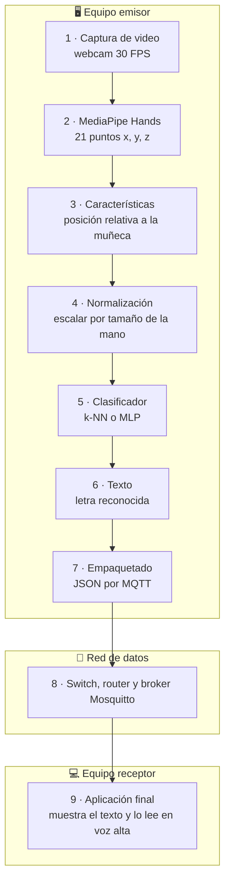
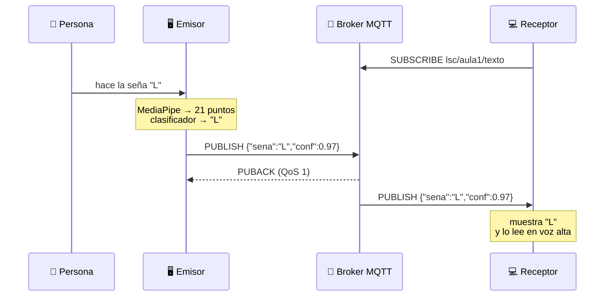
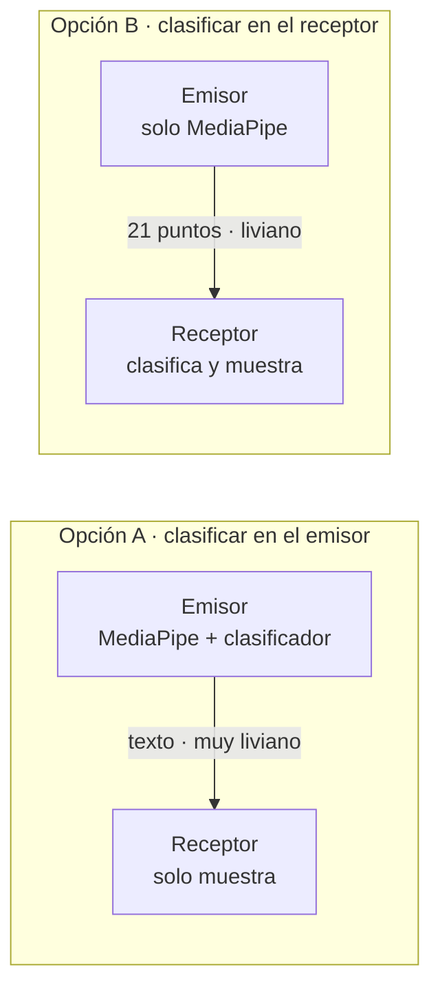
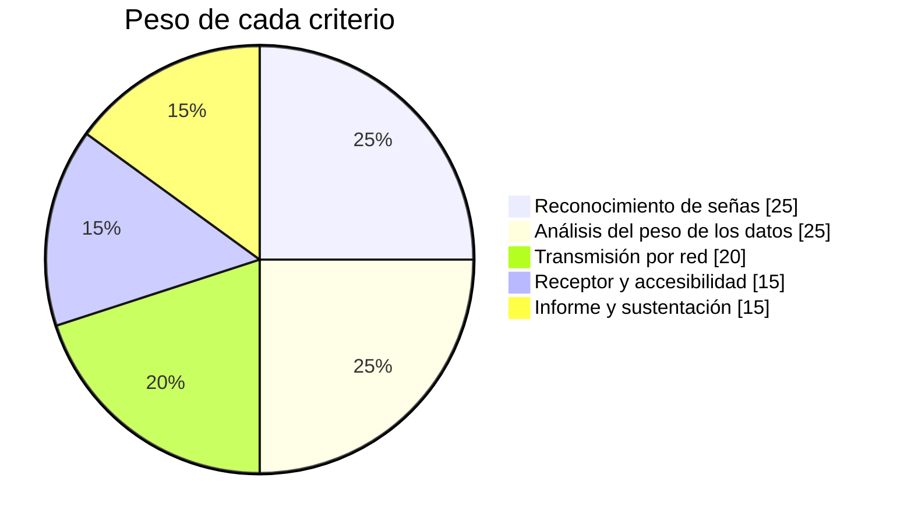

<div align="center">

# 🤟 Proyecto 2 · Redes de Datos con Visión Computacional

### Caso de estudio: lenguaje de señas con MediaPipe


### [▶️ Abrir la simulación](https://dialejobv.github.io/Proyectos_Productivos_SENA/#p2) · [⬅️ Volver al inicio](../README.md)

</div>

---

## 🎯 El reto

Una persona sorda necesita comunicarse con una persona oyente que está en otro computador de la red. Tu equipo debe construir un sistema que:

1. Reconozca señas de la **Lengua de Señas Colombiana (LSC)** con la cámara.
2. Las convierta en texto.
3. Envíe el resultado por la red.
4. Lo muestre y lo lea en voz alta en el otro computador.

El reto de redes es decidir **qué se envía**: ¿el video completo, los puntos de la mano o solo el texto?

> [!IMPORTANT]
> **Pregunta del proyecto:** ¿Qué representación de los datos (video, puntos de la mano o texto) permite transmitir lenguaje de señas con menor ancho de banda y latencia sin perder información útil?

## 🧩 En palabras simples

<details>
<summary><b>¿Qué es MediaPipe Hands?</b></summary>

<br/>

Es una herramienta de Google que encuentra la mano en la imagen y entrega **21 puntos** (llamados *landmarks*). Cada punto tiene tres números: `x`, `y`, `z`.

```
        8   12  16  20      ← puntas de los dedos
        |   |   |   |
        7   11  15  19
        |   |   |   |
        6   10  14  18
   4    |   |   |   |
    \   5 - 9 - 13 - 17     ← nudillos
     3   \           /
      \   \         /
       2   \       /
        \   \     /
         1 -- 0             ← 0 es la muñeca
```

</details>

<details>
<summary><b>¿Cómo sabe el computador qué seña es?</b></summary>

<br/>

Con un **clasificador**. Primero le mostramos muchos ejemplos de cada seña con su nombre (entrenamiento). Luego, cuando ve 21 puntos nuevos, busca a cuál seña se parecen más. Usaremos **k-NN** o una red pequeña (**MLP**).

</details>

<details>
<summary><b>¿Qué es MQTT?</b></summary>

<br/>

Es un protocolo muy liviano de **publicar y suscribir**. El emisor *publica* un mensaje en un tema (tópico), y todos los que estén *suscritos* a ese tema lo reciben. En el medio hay un programa llamado **broker** (usaremos Mosquitto).

| QoS | Garantía | Costo |
|:-:|---|---|
| 0 | A lo sumo una vez: si se pierde, se perdió | El más liviano |
| 1 | Al menos una vez: reenvía hasta confirmar | Puede llegar duplicado |
| 2 | Exactamente una vez | Cuatro mensajes de control |

</details>

## 🗺️ Arquitectura



### El viaje de una seña



## 📏 La idea central: ¿qué pesa menos?

El mismo mensaje se puede enviar de cinco formas. Mira la diferencia:

| Qué se envía | Tamaño por cuadro | Ancho de banda | Comparación |
|---|--:|--:|---|
| 🎞️ Video sin comprimir (640×480) | 921 600 B | 221 Mbps | 🟥🟥🟥🟥🟥🟥🟥🟥🟥🟥 |
| 🎬 Video H.264 | ≈ 6 250 B | 1,5 Mbps | 🟧🟧🟧🟧🟧🟧 |
| 📍 21 puntos en JSON | ≈ 380 B | 91 kbps | 🟨🟨🟨🟨 |
| 📍 21 puntos en binario | 260 B | 62 kbps | 🟨🟨🟨 |
| 🔤 Solo el texto | ≈ 31 B | 0,5 kbps | 🟩 |

> [!NOTE]
> Los valores son aproximados y la barra de colores está en escala logarítmica. El texto solo se envía cuando cambia la seña, por eso pesa tan poco. Tu equipo debe medir los valores reales con Wireshark.

<details>
<summary><b>🤔 Si el texto pesa tan poco, ¿por qué no enviar siempre texto?</b></summary>

<br/>

Porque al enviar solo texto se pierde información: el receptor ya no puede ver la mano ni corregir un error del clasificador. Enviar los puntos permite clasificar en el receptor o dibujar la mano. **Tu equipo debe decidir y justificar** dónde va el clasificador:



</details>

## 🚀 Primeros pasos

<details>
<summary><b>Paso 1 · Ver los 21 puntos de tu mano</b></summary>

<br/>

```bash
pip install mediapipe opencv-python
```

```python
import cv2
import mediapipe as mp

mp_hands = mp.solutions.hands
dibujo = mp.solutions.drawing_utils
cap = cv2.VideoCapture(0)

with mp_hands.Hands(max_num_hands=1) as hands:
    while True:
        ok, frame = cap.read()
        if not ok:
            break
        res = hands.process(cv2.cvtColor(frame, cv2.COLOR_BGR2RGB))
        if res.multi_hand_landmarks:
            mano = res.multi_hand_landmarks[0]
            dibujo.draw_landmarks(frame, mano, mp_hands.HAND_CONNECTIONS)
            puntos = [(p.x, p.y, p.z) for p in mano.landmark]   # 21 puntos
        cv2.imshow("Mano", frame)
        if cv2.waitKey(1) == 27:
            break

cap.release()
cv2.destroyAllWindows()
```

> Si tu versión de MediaPipe ya no trae `mp.solutions`, usa la API nueva **Hand Landmarker** de MediaPipe Tasks. Entrega los mismos 21 puntos.

</details>

<details>
<summary><b>Paso 2 · Entrenar el clasificador</b></summary>

<br/>

Guarda en `dataset.csv` una fila por muestra: 63 números (21 puntos × 3) y al final la letra.

```python
import pandas as pd
from sklearn.model_selection import train_test_split
from sklearn.neighbors import KNeighborsClassifier
import joblib

df = pd.read_csv("dataset.csv")
X, y = df.iloc[:, :-1], df.iloc[:, -1]
X_tr, X_te, y_tr, y_te = train_test_split(X, y, test_size=0.2, random_state=1)

modelo = KNeighborsClassifier(n_neighbors=5).fit(X_tr, y_tr)
print("Precisión:", modelo.score(X_te, y_te))
joblib.dump(modelo, "modelo.pkl")
```

</details>

<details>
<summary><b>Paso 3 · Enviar la seña por MQTT</b></summary>

<br/>

```bash
pip install paho-mqtt
```

**Emisor**

```python
import json, time
import paho.mqtt.client as mqtt

c = mqtt.Client(mqtt.CallbackAPIVersion.VERSION2)
c.connect("192.168.10.10")          # IP del equipo con Mosquitto
c.loop_start()

msg = {"sena": "L", "conf": 0.97, "t": time.time()}
c.publish("lsc/aula1/texto", json.dumps(msg), qos=1)
```

**Receptor**

```python
import json, time
import paho.mqtt.client as mqtt

def al_recibir(client, userdata, m):
    d = json.loads(m.payload)
    retardo = (time.time() - d["t"]) * 1000
    print(d["sena"], f"· {len(m.payload)} bytes · {retardo:.0f} ms")

c = mqtt.Client(mqtt.CallbackAPIVersion.VERSION2)
c.on_message = al_recibir
c.connect("192.168.10.10")
c.subscribe("lsc/aula1/texto", qos=1)
c.loop_forever()
```

> Para que el retardo sea correcto, los dos equipos deben tener el reloj sincronizado.

</details>

## 🧪 Experimentos

| Experimento | Qué cambias | Qué mides |
|---|---|---|
| A | Formato: video, puntos en JSON, texto | Bytes por segundo en Wireshark |
| B | QoS 0, 1 y 2 | Mensajes perdidos y duplicados |
| C | Iluminación y fondo | Precisión del clasificador |
| D | Clasificar en el emisor o en el receptor | Latencia total |

> [!TIP]
> Prueba primero en la [simulación](https://dialejobv.github.io/Proyectos_Productivos_SENA/#p2): sube la pérdida de la red al 30 % y compara QoS 0 con QoS 1.

## 📅 Plan de 10 semanas

- [ ] **Semana 1** · LSC y la comunidad sorda; qué es un landmark → *mapa conceptual y lista de señas*
- [ ] **Semana 2** · MediaPipe: dibujar los 21 puntos → *landmarks.py*
- [ ] **Semana 3** · Construir el dataset → *dataset.csv*
- [ ] **Semana 4** · Entrenar el clasificador → *modelo.pkl y precisión*
- [ ] **Semana 5** · Reconocimiento en vivo con subtítulos → *demo local*
- [ ] **Semana 6** · Mosquitto: publicar y suscribir entre 2 PC → *captura Wireshark*
- [ ] **Semana 7** · Comparar formatos → *tabla y gráfica de bytes por segundo*
- [ ] **Semana 8** · Receptor con texto y voz → *receptor funcionando*
- [ ] **Semana 9** · Pruebas con usuarios → *registro de pruebas*
- [ ] **Semana 10** · Socialización → *informe y sustentación*

## ✅ Alcance

| Sí incluye | No incluye |
|---|---|
| 5 a 10 señas estáticas del alfabeto LSC | Traducir frases completas o la gramática de LSC |
| Dataset propio, unas 100 muestras por seña | Entrenar Transformers desde cero |
| MQTT dentro de la red del laboratorio | Publicar una app móvil |
| Medición de bytes por segundo | |

> [!WARNING]
> Graba a tus compañeros solo con su consentimiento. Valida las señas con un intérprete o una asociación de personas sordas: una seña mal hecha enseña algo incorrecto.

## 🏆 Evaluación



## 🧠 Pon a prueba lo aprendido

<details>
<summary>1. ¿Cuántos números describen una mano en un cuadro?</summary>

<br/>

63 números: 21 puntos × 3 coordenadas (x, y, z).

</details>

<details>
<summary>2. ¿Por qué los puntos pesan tanto menos que el video?</summary>

<br/>

Un cuadro de 640×480 tiene 921 600 bytes de píxeles. Los puntos son solo 63 números. Se envía únicamente la información que importa para reconocer la seña.

</details>

<details>
<summary>3. Con QoS 0 y 20 % de pérdida, ¿qué le pasa a la palabra que recibe el otro equipo?</summary>

<br/>

Le faltan letras. QoS 0 no reenvía los mensajes perdidos.

</details>

<details>
<summary>4. ¿Por qué QoS 1 puede mostrar una letra repetida?</summary>

<br/>

Si el mensaje llegó pero la confirmación (PUBACK) se perdió, el emisor lo reenvía y el receptor lo recibe dos veces.

</details>

## 📚 Artículos científicos

| Artículo | Para qué sirve |
|---|---|
| Lugaresi et al. (2019). [MediaPipe: A Framework for Building Perception Pipelines](https://arxiv.org/abs/1906.08172) | Qué es MediaPipe y cómo trabaja por etapas |
| Zhang et al. (2020). [MediaPipe Hands: On-device Real-time Hand Tracking](https://arxiv.org/abs/2006.10214) | El modelo de 21 puntos |
| [Reconocimiento de lengua de señas colombiana mediante redes neuronales convolucionales y captura de movimiento](https://revistas.udistrital.edu.co/index.php/Tecnura/article/view/19213). Revista Tecnura | Antecedente colombiano sobre LSC |
| [Reconocimiento de la lengua de señas colombiana mediante redes neuronales con memoria a largo y corto plazo](http://www.scielo.org.co/scielo.php?pid=S0121-11292025000118059&script=sci_arttext&tlng=es) (2025). Revista Facultad de Ingeniería | LSTM para señas con movimiento |
| Rastgoo, Kiani y Escalera (2021). [Sign Language Recognition: A Deep Survey](https://doi.org/10.1016/j.eswa.2020.113794). Expert Systems with Applications | Panorama general del área |
| Hunkeler, Truong y Stanford-Clark (2008). [MQTT-S: A Publish/Subscribe Protocol for Wireless Sensor Networks](https://doi.org/10.1109/COMSWA.2008.4554519). COMSWARE | Fundamento de publicar y suscribir |
