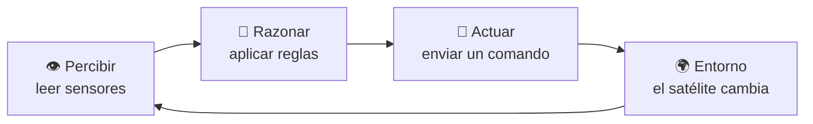
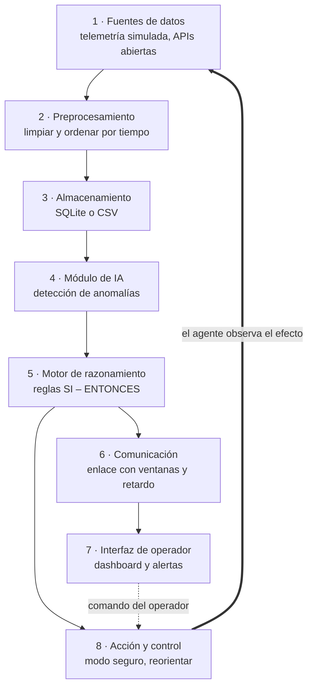
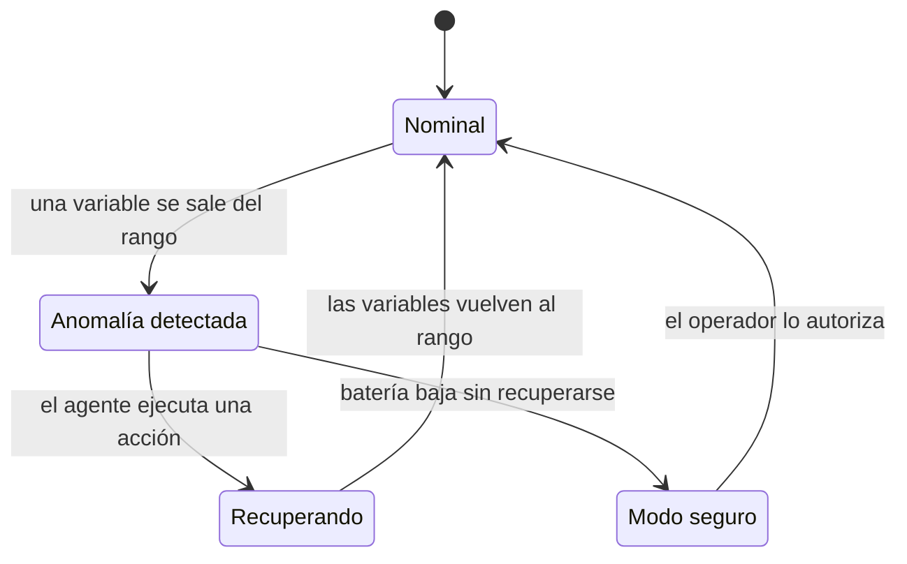
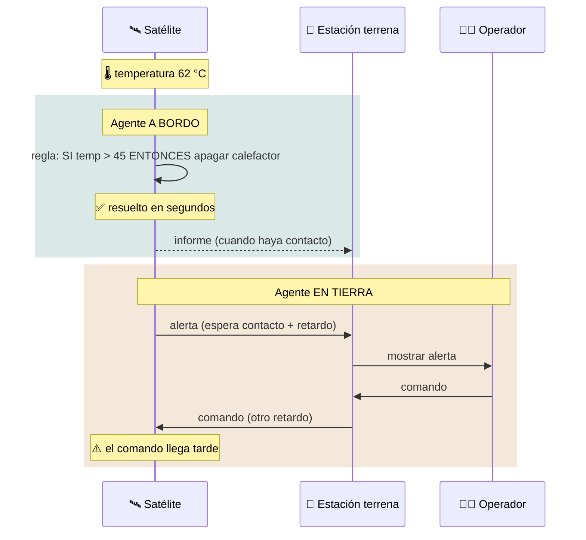
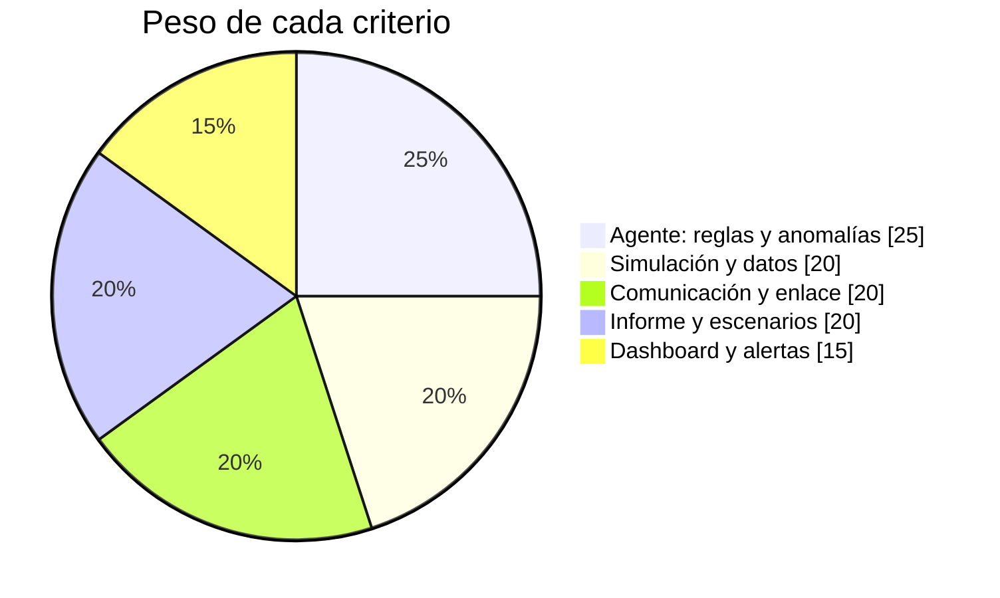

<div align="center">

# 🛰️ Proyecto 3 · Agente Inteligente de Ingeniería Aeroespacial

### Prototipo inicial en la era de los sistemas teleinformáticos


### [▶️ Abrir la simulación](https://dialejobv.github.io/Proyectos_Productivos_SENA/#p3) · [⬅️ Volver al inicio](../README.md)

</div>

---

## 🎯 El reto

Un centro de control vigila un satélite pequeño (un **CubeSat**) que da vueltas a la Tierra. El satélite solo se puede comunicar con la estación terrena durante **unos minutos en cada vuelta**. El resto del tiempo está solo.

Tu equipo debe construir un **agente inteligente** que:

1. Lea la telemetría del satélite (batería, temperatura, orientación).
2. Detecte cuando algo anda mal.
3. Decida qué hacer.
4. Comunique lo que pasó cuando haya enlace.

> [!IMPORTANT]
> **Pregunta del proyecto:** ¿Cómo debe decidir un agente inteligente cuándo actuar por sí mismo y cuándo esperar al operador, según la disponibilidad y el retardo del enlace?

## 🧩 En palabras simples

<details>
<summary><b>¿Qué es un agente inteligente?</b></summary>

<br/>

Es un programa que **percibe** su entorno, **decide** y **actúa**, una y otra vez. Un termostato es un agente muy simple: mide la temperatura, compara con el límite y enciende o apaga.



</details>

<details>
<summary><b>¿Qué es la telemetría?</b></summary>

<br/>

Son las mediciones que un equipo lejano envía para saber cómo está. En el proyecto usaremos tres:

| Variable | Valor normal | Qué indica si se sale |
|---|---|---|
| 🔋 Batería | 40 % a 100 % | Falla en un panel solar |
| 🌡️ Temperatura | 10 °C a 40 °C | Sobrecalentamiento |
| 🧭 Error de actitud | menos de 5° | El satélite perdió la orientación |

</details>

<details>
<summary><b>¿Qué es una ventana de contacto?</b></summary>

<br/>

Es el rato en que el satélite pasa por encima de la estación terrena y se pueden comunicar. Cuando sale de esa zona, no hay enlace hasta la siguiente vuelta.

</details>

<details>
<summary><b>¿Qué es DTN o "guardar y reenviar"?</b></summary>

<br/>

DTN significa *red tolerante a retardos*. La idea: si no hay enlace, el satélite **guarda** los mensajes en una cola y los **reenvía** cuando vuelve el contacto. Así no se pierde nada.

</details>

## 🗺️ Arquitectura

La arquitectura original es una línea de 8 bloques. Aquí se convierte en un **ciclo**: después de actuar, el agente vuelve a mirar los datos para ver si su acción funcionó.



<details>
<summary><b>🔍 Ver cada bloque con su herramienta</b></summary>

<br/>

| # | Bloque | Herramienta | Nota |
|:-:|---|---|---|
| 1 | Fuentes de datos | Simulador en Python; posición de la ISS; TLE de CelesTrak | Empezar con datos simulados |
| 2 | Preprocesamiento | `pandas` | Unidades y timestamps |
| 3 | Almacenamiento | SQLite o CSV | InfluxDB como reto |
| 4 | Módulo de IA | Umbrales, z-score, Isolation Forest | Métodos que se pueden explicar |
| 5 | Razonamiento | Reglas en Python; LLM opcional | El LLM solo redacta la explicación |
| 6 | Comunicación | MQTT con QoS 1 y una cola | Dos equipos: "satélite" y "estación" |
| 7 | Interfaz | Streamlit | Gráficas y alertas |
| 8 | Acción | Comandos simulados | Cambian la telemetría simulada |

</details>

### Los estados del satélite



## 📏 La idea central: la distancia cambia todo

La señal viaja a la velocidad de la luz, pero el espacio es enorme.

| Misión | Retardo de ida | Ida y vuelta | ¿Se puede controlar desde tierra? |
|---|--:|--:|---|
| 🌍 Órbita baja | milisegundos | milisegundos | ✅ Sí, pero solo durante la ventana de contacto |
| 🌕 Luna | 1,3 s | 2,6 s | ⚠️ Con dificultad |
| 🔴 Marte | 3 a 22 min | 6 a 44 min | ❌ No en tiempo real |

### El mismo problema, dos lugares para decidir



> [!NOTE]
> Esta es la razón por la que los robots en Marte toman muchas decisiones solos. Tu informe debe explicar en qué casos conviene cada opción.

## 🚀 Primeros pasos

<details>
<summary><b>Paso 1 · Simular la telemetría</b></summary>

<br/>

```python
import random, math, csv

def telemetria(t, falla=None):
    en_sol = math.cos(t / 90) > -0.5
    bat  = 80 + (10 if en_sol else -10) * math.sin(t / 90)
    temp = (28 if en_sol else 12) + random.uniform(-1, 1)
    act  = abs(random.gauss(0.4, 0.2))
    if falla == "temp": temp += 30
    if falla == "act":  act  += 12
    return {"t": t, "bateria": round(bat, 1), "temp": round(temp, 1), "actitud": round(act, 2)}

with open("telemetria.csv", "w", newline="") as f:
    w = csv.DictWriter(f, fieldnames=["t", "bateria", "temp", "actitud"])
    w.writeheader()
    for t in range(600):
        w.writerow(telemetria(t, "temp" if 300 < t < 360 else None))
```

</details>

<details>
<summary><b>Paso 2 · El agente con reglas</b></summary>

<br/>

```python
REGLAS = [
    (lambda d: d["temp"] > 45,    "calefactor_off", "sobretemperatura"),
    (lambda d: d["actitud"] > 5,  "reorientar",     "pérdida de actitud"),
    (lambda d: d["bateria"] < 35, "modo_seguro",    "batería baja"),
]

def agente(dato):
    for condicion, accion, motivo in REGLAS:      # RAZONAR
        if condicion(dato):
            return accion, motivo
    return None, None

cola = []                                         # mensajes guardados a bordo

def ciclo(dato, hay_contacto):
    accion, motivo = agente(dato)                 # PERCIBIR + RAZONAR
    if accion:
        print(f"t={dato['t']} · {motivo} → {accion}")   # ACTUAR
        cola.append({"t": dato["t"], "evento": motivo, "accion": accion})
    if hay_contacto and cola:                     # guardar y reenviar
        print(f"  📡 enviando {len(cola)} mensajes guardados")
        cola.clear()
```

</details>

<details>
<summary><b>Paso 3 · Detectar anomalías con z-score</b></summary>

<br/>

El z-score dice qué tan lejos está un valor del promedio reciente. Si es mayor que 3, es sospechoso.

```python
import pandas as pd

df = pd.read_csv("telemetria.csv")
media = df["temp"].rolling(60).mean()
desv  = df["temp"].rolling(60).std()
df["z"] = (df["temp"] - media) / desv
print(df[df["z"].abs() > 3][["t", "temp", "z"]])
```

</details>

## 🧪 Experimentos

| Experimento | Qué cambias | Qué mides |
|---|---|---|
| A | Tipo de falla | Tiempo que tarda el agente en detectarla |
| B | Agente a bordo o en tierra | Tiempo hasta que se corrige la falla |
| C | Escenario: órbita baja, Luna, Marte | Efecto del retardo |
| D | Duración de la ventana de contacto | Tamaño máximo de la cola |

> [!TIP]
> En la [simulación](https://dialejobv.github.io/Proyectos_Productivos_SENA/#p3) elige **Marte** y **agente en tierra**, luego inyecta una sobretemperatura. Observa cuánto tarda en llegar el comando.

## 📅 Plan de 10 semanas

- [ ] **Semana 1** · Órbitas, telemetría y agentes → *mapa conceptual*
- [ ] **Semana 2** · Simulador de telemetría → *telemetria.py y CSV*
- [ ] **Semana 3** · Datos abiertos: posición de la ISS → *script y gráfica*
- [ ] **Semana 4** · Almacenamiento y gráficas → *base SQLite*
- [ ] **Semana 5** · Detección de anomalías → *reporte de detecciones*
- [ ] **Semana 6** · Motor de reglas → *agente.py*
- [ ] **Semana 7** · Enlace entre 2 equipos con cola → *captura del tráfico*
- [ ] **Semana 8** · Dashboard del operador → *dashboard con alertas*
- [ ] **Semana 9** · Escenarios LEO, Luna y Marte → *tabla de resultados*
- [ ] **Semana 10** · Socialización → *informe y sustentación*

## ✅ Alcance

| Sí incluye | No incluye |
|---|---|
| Satélite simulado con 3 o 4 variables | Controlar hardware espacial real |
| 3 tipos de falla | Calcular órbitas con precisión |
| Agente de reglas con detección estadística | Entrenar modelos de lenguaje |
| Enlace simulado con ventanas y retardo | |

> [!NOTE]
> Reto opcional: armar un "CubeSat de mesa" con una Raspberry Pi, un sensor de temperatura DHT11 y un sensor de movimiento MPU6050 para usar datos reales.

## 🏆 Evaluación



## 🧠 Pon a prueba lo aprendido

<details>
<summary>1. ¿Cuáles son los tres pasos que repite un agente?</summary>

<br/>

Percibir, razonar y actuar.

</details>

<details>
<summary>2. El satélite está fuera de la ventana de contacto. ¿Qué hace con la telemetría?</summary>

<br/>

La guarda en una cola a bordo y la envía cuando vuelve el contacto (guardar y reenviar).

</details>

<details>
<summary>3. ¿Por qué un robot en Marte no se puede manejar con un control remoto en tiempo real?</summary>

<br/>

Porque la señal tarda entre 3 y 22 minutos en cada sentido. Cuando el comando llega, la situación ya cambió.

</details>

<details>
<summary>4. ¿Por qué el diagrama del agente es un ciclo y no una línea?</summary>

<br/>

Porque después de actuar, el agente debe volver a leer los sensores para comprobar si la acción funcionó.

</details>

## 📚 Artículos científicos

| Fuente | Para qué sirve |
|---|---|
| Russell y Norvig (2021). [Artificial Intelligence: A Modern Approach](https://aima.cs.berkeley.edu/), 4.ª ed. | Definición y tipos de agentes (capítulo 2) |
| Hundman et al. (2018). [Detecting Spacecraft Anomalies Using LSTMs and Nonparametric Dynamic Thresholding](https://arxiv.org/abs/1802.04431). KDD | Anomalías en telemetría real de la NASA |
| Burleigh et al. (2003). [Delay-Tolerant Networking: An Approach to Interplanetary Internet](https://doi.org/10.1109/MCOM.2003.1204759). IEEE Communications Magazine | Base de guardar y reenviar |
| Yao et al. (2023). [ReAct: Synergizing Reasoning and Acting in Language Models](https://arxiv.org/abs/2210.03629). ICLR | Agentes que razonan y actúan con LLM |
| Wang et al. (2024). [A Survey on Large Language Model based Autonomous Agents](https://doi.org/10.1007/s11704-024-40231-1). Frontiers of Computer Science | Partes de un agente moderno |
