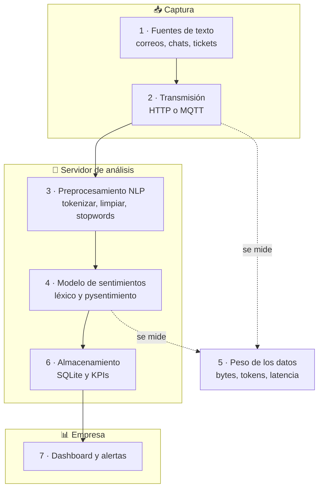
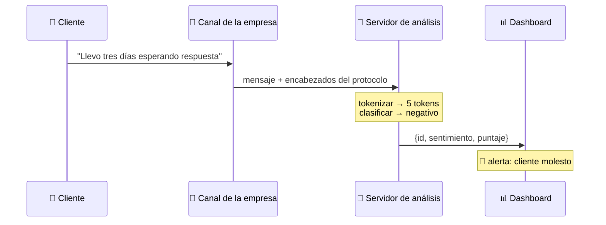
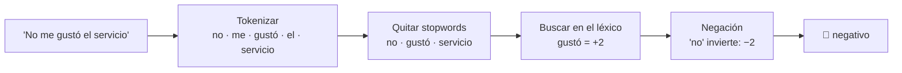
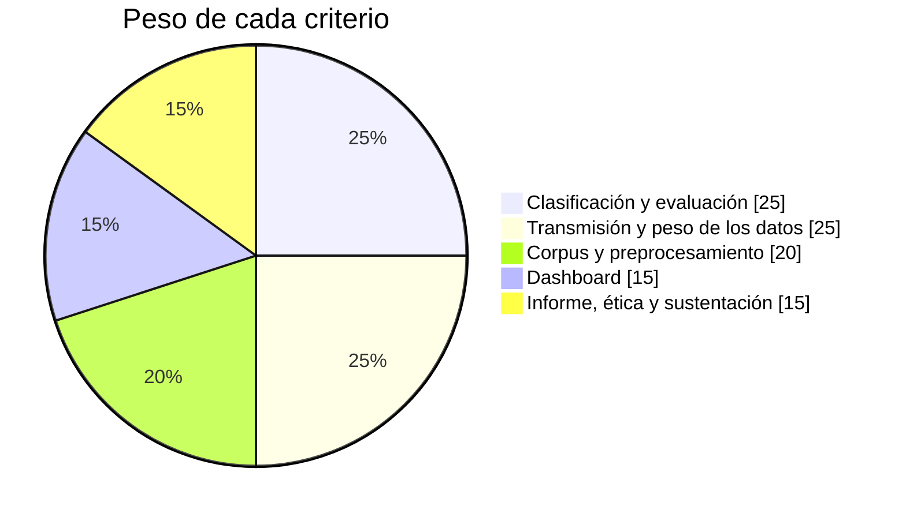

<div align="center">

# 💬 Proyecto 4 · Análisis de Sentimientos en el Sector Empresarial

### Sistemas teleinformáticos, comunicación escrita y el peso de los datos


### [▶️ Abrir la simulación](https://dialejobv.github.io/Proyectos_Productivos_SENA/#p4) · [⬅️ Volver al inicio](../README.md)

</div>

---

## 🎯 El reto

Una empresa recibe cada día cientos de correos, chats y tickets de sus clientes. Nadie alcanza a leerlos todos. Tu equipo debe construir un sistema que:

1. Reciba los mensajes por la red.
2. Los divida en **tokens**.
3. Clasifique cada uno como **positivo**, **negativo** o **neutro**.
4. Muestre un tablero con los resultados y alertas.

Además debe **medir cuánto pesa** cada mensaje al viajar por la red.

> [!IMPORTANT]
> **Pregunta del proyecto:** ¿Cuánto pesa, en bytes y en tiempo de transmisión, el análisis de sentimientos de la comunicación escrita de una empresa, y cómo influyen el protocolo y la compresión?

## 🧩 En palabras simples

<details>
<summary><b>¿Qué es el análisis de sentimientos?</b></summary>

<br/>

Es hacer que el computador diga si un texto expresa algo bueno, malo o ninguno de los dos.

| Mensaje | Sentimiento |
|---|:-:|
| "El servicio fue excelente, muchas gracias." | 🟢 positivo |
| "El producto llegó dañado y la atención fue pésima." | 🔴 negativo |
| "Solicito el cambio de dirección de entrega." | ⚪ neutro |

</details>

<details>
<summary><b>¿Qué es un token?</b></summary>

<br/>

Es un pedazo de texto: una palabra, un signo o parte de una palabra. **Tokenizar** es cortar el texto en esos pedazos.

```
Texto:        "El soporte no responde."
Por palabras: [el] [soporte] [no] [responde] [.]              → 5 tokens
Subpalabras:  [el] [sop] [##orte] [no] [respond] [##e] [.]    → 7 tokens
```

Los modelos modernos como BERT usan **subpalabras**. Por eso un texto casi siempre tiene más tokens que palabras.

</details>

<details>
<summary><b>¿Qué es una stopword?</b></summary>

<br/>

Una palabra muy común que casi no aporta significado: *el, la, de, que, y, en*. En los métodos simples se eliminan para quedarse con las palabras importantes.

</details>

<details>
<summary><b>¿Bytes y tokens son lo mismo?</b></summary>

<br/>

No. Miden cosas distintas:

| Medida | Qué cuenta | A quién le importa |
|---|---|---|
| **Bytes** | Lo que ocupa el texto al viajar o guardarse | A la **red** |
| **Tokens** | Los pedazos que lee el modelo | Al **modelo de IA** |

En UTF-8, una letra sin tilde ocupa 1 byte; una con tilde o la ñ ocupa 2; un emoji ocupa 4.

</details>

## 🗺️ Arquitectura



<details>
<summary><b>🔍 Ver cada bloque con su herramienta</b></summary>

<br/>

| # | Bloque | Herramienta | Nota |
|:-:|---|---|---|
| 1 | Fuentes de texto | Corpus ficticio escrito por el equipo | Nunca datos personales reales |
| 2 | Transmisión | Flask (HTTP) y MQTT | Se montan los dos para compararlos |
| 3 | Preprocesamiento | spaCy o NLTK | Minúsculas, signos, stopwords |
| 4 | Modelo | Léxico y `pysentimiento` | Sin entrenar nada |
| 5 | Peso de los datos | `len(texto.encode())`, Wireshark, gzip | El corazón del proyecto |
| 6 | Almacenamiento | SQLite | Mensajes y resultados |
| 7 | Visualización | Streamlit | Porcentajes y alertas |

</details>

### El viaje de un mensaje



### Cómo se procesa una frase



## 📏 La idea central: el mensaje no viaja solo

Cada protocolo le agrega **encabezados** al mensaje. Con textos cortos, los encabezados pueden pesar más que el propio texto.

| Protocolo | Lo que agrega (aprox.) | Mensaje de 150 B | Parte útil |
|---|--:|--:|---|
| HTTP/1.1 + JSON | 600 B | 790 B | 🟩🟩⬜⬜⬜⬜⬜⬜⬜⬜ 19 % |
| MQTT | 24 B | 214 B | 🟩🟩🟩🟩🟩🟩🟩⬜⬜⬜ 70 % |
| Kafka (en lotes) | 70 B | 221 B | 🟩🟩🟩🟩🟩🟩🟩⬜⬜⬜ 68 % |

> [!NOTE]
> Valores aproximados. Incluyen 40 bytes de TCP/IP por segmento. Tu equipo debe medir los reales con Wireshark.

<details>
<summary><b>🤔 ¿Y si se envía solo el resultado?</b></summary>

<br/>

Si el análisis se hace cerca de donde llega el mensaje, a la central solo hay que enviarle esto:

```json
{"id": "a81f3c", "sent": "neg", "score": -3}
```

Son unos 40 bytes en vez de 150. Se ahorra red, pero la central ya no tiene el texto original para revisarlo. **Tu equipo debe comparar las dos opciones.**

</details>

<details>
<summary><b>🤔 ¿Sirve comprimir?</b></summary>

<br/>

Con gzip, un texto largo puede bajar bastante de tamaño. Pero en mensajes muy cortos gzip **agrega** unos 20 bytes y no ahorra nada. Compruébalo en el experimento C.

</details>

## 🚀 Primeros pasos

<details>
<summary><b>Paso 1 · Tokenizar y medir el peso</b></summary>

<br/>

```python
import re

texto = "El producto llegó dañado y la atención fue pésima 😡"

tokens = re.findall(r"\w+|[^\w\s]", texto.lower())
print(tokens)
print("Tokens:", len(tokens))
print("Caracteres:", len(texto))
print("Bytes UTF-8:", len(texto.encode("utf-8")))
```

¿Por qué hay más bytes que caracteres?

</details>

<details>
<summary><b>Paso 2 · Clasificador con léxico</b></summary>

<br/>

```python
LEXICO = {"excelente": 3, "gracias": 2, "rápido": 2, "satisfecho": 3, "gustó": 2,
          "pésima": -3, "dañado": -3, "problema": -2, "molesto": -3, "tarde": -2}
NEGACION = {"no", "nunca", "ni"}

def sentimiento(tokens):
    puntaje, negar = 0, False
    for t in tokens:
        if t in NEGACION:
            negar = True
        elif t in LEXICO:
            puntaje += -LEXICO[t] if negar else LEXICO[t]
            negar = False
    if puntaje > 0:  return "positivo", puntaje
    if puntaje < 0:  return "negativo", puntaje
    return "neutro", puntaje

print(sentimiento(["no", "me", "gustó", "el", "servicio"]))
```

</details>

<details>
<summary><b>Paso 3 · Modelo preentrenado</b></summary>

<br/>

```bash
pip install pysentimiento
```

```python
from pysentimiento import create_analyzer

analizador = create_analyzer(task="sentiment", lang="es")
r = analizador.predict("No está mal, pero el precio subió bastante")
print(r.output, r.probas)      # POS, NEG o NEU con sus probabilidades
```

Compara: ¿en cuáles mensajes acierta el modelo y falla el léxico?

</details>

<details>
<summary><b>Paso 4 · Servidor que recibe mensajes</b></summary>

<br/>

```python
from flask import Flask, request, jsonify

app = Flask(__name__)

@app.post("/analizar")
def analizar():
    texto = request.get_json()["texto"]
    etiqueta, puntaje = sentimiento(texto.lower().split())
    return jsonify(sent=etiqueta, score=puntaje, bytes=len(texto.encode("utf-8")))

app.run(host="0.0.0.0", port=5000)
```

Desde otro equipo:

```bash
curl -X POST http://192.168.10.10:5000/analizar -H "Content-Type: application/json" -d '{"texto":"excelente servicio"}'
```

</details>

## 🧪 Experimentos

| Experimento | Qué cambias | Qué mides |
|---|---|---|
| A | Léxico o modelo preentrenado | Precisión con el corpus etiquetado |
| B | HTTP o MQTT | Bytes por mensaje en Wireshark |
| C | Con gzip y sin gzip | Tamaño según el largo del mensaje |
| D | 100, 1 000 y 10 000 mensajes | Tráfico total y tiempo |
| E | Texto completo o solo el resultado | Bytes ahorrados |

> [!TIP]
> En la [simulación](https://dialejobv.github.io/Proyectos_Productivos_SENA/#p4) escribe tus propios mensajes y cambia de MQTT a HTTP. Mira cómo baja la eficiencia.

## 📅 Plan de 10 semanas

- [ ] **Semana 1** · Comunicación escrita, NLP y sentimiento → *mapa conceptual*
- [ ] **Semana 2** · Escribir y etiquetar el corpus → *corpus.csv*
- [ ] **Semana 3** · Tokenizar, limpiar y contar tokens y bytes → *notebook*
- [ ] **Semana 4** · Clasificador por léxico → *precisión de la línea base*
- [ ] **Semana 5** · Modelo preentrenado → *comparación de precisión*
- [ ] **Semana 6** · Servidor Flask → *API funcionando entre 2 PC*
- [ ] **Semana 7** · MQTT y Wireshark → *tabla de encabezados*
- [ ] **Semana 8** · Compresión y volumen → *gráficas*
- [ ] **Semana 9** · Dashboard de KPIs → *dashboard*
- [ ] **Semana 10** · Socialización → *informe y sustentación*

## ✅ Alcance

| Sí incluye | No incluye |
|---|---|
| Corpus de 200 a 500 mensajes en español | Entrenar un modelo de lenguaje |
| Tokenización y dos formas de clasificar | Conectarse al correo o CRM de una empresa real |
| HTTP y MQTT en la red del laboratorio | Detectar sarcasmo o emociones finas |
| Medición de bytes, tokens y latencia | |

> [!WARNING]
> **Protección de datos.** No uses mensajes reales con nombres, teléfonos o correos de personas. En Colombia, la Ley 1581 de 2012 protege los datos personales. Trabaja con mensajes inventados o anonimizados.

## 🏆 Evaluación



## 🧠 Pon a prueba lo aprendido

<details>
<summary>1. ¿Cuántos bytes ocupa la palabra "atención" en UTF-8?</summary>

<br/>

9 bytes. Tiene 8 letras, pero la "ó" ocupa 2 bytes.

</details>

<details>
<summary>2. ¿Por qué "No me gustó" es negativo si "gustó" es una palabra positiva?</summary>

<br/>

Por la **negación**. La palabra "no" invierte el sentido de lo que sigue. Un buen clasificador debe tenerlo en cuenta.

</details>

<details>
<summary>3. Un mensaje de 50 bytes viaja por HTTP con 600 bytes de encabezados. ¿Qué porcentaje es información útil?</summary>

<br/>

Cerca del 8 %: 50 ÷ 650. Por eso, con mensajes cortos y frecuentes, conviene un protocolo liviano como MQTT.

</details>

<details>
<summary>4. ¿Por qué un texto tiene más tokens que palabras en un modelo como BERT?</summary>

<br/>

Porque el modelo corta las palabras poco comunes en subpalabras, y cada signo de puntuación cuenta como un token.

</details>

## 📚 Artículos científicos

| Artículo | Para qué sirve |
|---|---|
| Pang, Lee y Vaithyanathan (2002). [Thumbs up? Sentiment Classification using Machine Learning Techniques](https://arxiv.org/abs/cs/0205070). EMNLP | Trabajo pionero del área |
| Devlin et al. (2019). [BERT: Pre-training of Deep Bidirectional Transformers](https://arxiv.org/abs/1810.04805). NAACL | El modelo base de los clasificadores actuales |
| Sennrich, Haddow y Birch (2016). [Neural Machine Translation of Rare Words with Subword Units](https://arxiv.org/abs/1508.07909). ACL | Tokenización por subpalabras (BPE) |
| Kudo y Richardson (2018). [SentencePiece: A Simple and Language Independent Subword Tokenizer](https://arxiv.org/abs/1808.06226). EMNLP | Tokenizador usado por muchos modelos |
| Cañete et al. (2020). [Spanish Pre-Trained BERT Model and Evaluation Data](https://arxiv.org/abs/2308.02976) (BETO) | BERT entrenado en español |
| Pérez, Giudici y Luque (2021). [pysentimiento: A Python Toolkit for Sentiment Analysis](https://arxiv.org/abs/2106.09462) | La librería que usa el proyecto |
| Hutto y Gilbert (2014). [VADER: A Parsimonious Rule-based Model for Sentiment Analysis](https://doi.org/10.1609/icwsm.v8i1.14550). ICWSM | Método por léxico y reglas |
