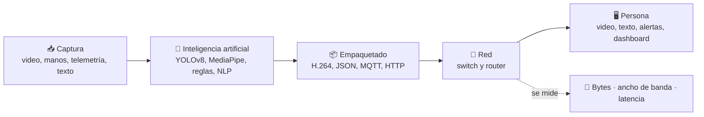

# 🌐 Proyectos Productivos SENA

### Redes, visión computacional e inteligencia artificial en sistemas teleinformáticos

**Media técnica · Grado 11**

### [▶️ Abrir las simulaciones interactivas](https://dialejobv.github.io/Proyectos_Productivos_SENA/)

---

## 🧭 Elige tu proyecto

| # | Proyecto | ¿De qué trata? | Guía | Simulación |
|:-:|---|---|:-:|:-:|
| 1 | **Streaming con YOLOv8** | Detectar objetos en video y transmitirlo por una red con switch y router | [📘 Abrir](1%29%20Proyecto/README.md) | [▶️](https://dialejobv.github.io/Proyectos_Productivos_SENA/#p1) |
| 2 | **Lenguaje de señas con MediaPipe** | Reconocer señas y enviar el resultado por la red con el menor peso posible | [📘 Abrir](2%29%20Proyecto/README.md) | [▶️](https://dialejobv.github.io/Proyectos_Productivos_SENA/#p2) |
| 3 | **Agente inteligente aeroespacial** | Un agente que vigila un satélite y decide qué hacer cuando no hay enlace | [📘 Abrir](3%29%20Proyecto/README.md) | [▶️](https://dialejobv.github.io/Proyectos_Productivos_SENA/#p3) |
| 4 | **Análisis de sentimientos empresarial** | Clasificar mensajes de clientes y medir cuánto pesan al transmitirse | [📘 Abrir](4%29%20Proyecto/README.md) | [▶️](https://dialejobv.github.io/Proyectos_Productivos_SENA/#p4) |

## 🔗 Lo que tienen en común

Los cuatro proyectos siguen el mismo camino: **capturar datos → procesarlos con IA → transmitirlos por la red → mostrarlos a una persona**. En todos se mide lo mismo: cuánto pesan los datos y cuánto tardan en llegar.

## 👥 Cómo se trabaja

| Rol | Responsabilidad |
|---|---|
| 🔌 Redes | Topología, VLAN, router, capturas con Wireshark |
| 💻 Programación | Scripts de Python y pruebas |
| 📊 Datos | Mediciones, tablas y gráficas |
| 📝 Documentación | Bitácora semanal, informe y sustentación |

> [!TIP]
> Cada guía tiene secciones que se abren al hacer clic en el triángulo ▶. Úsalas para estudiar: primero intenta responder y luego abre la respuesta.

## 📦 Entregas de todos los proyectos

- [ ] Repositorio en GitHub con el código y este README actualizado
- [ ] Bitácora semanal del equipo
- [ ] Tabla de mediciones y gráficas
- [ ] Informe técnico
- [ ] Sustentación con demostración en vivo

<b>⚙️ Para el instructor: cómo activar las simulaciones</b>

 

El archivo `index.html` de la raíz contiene las cuatro simulaciones. Para que los enlaces ▶️ funcionen:

1. En GitHub, entrar a **Settings → Pages**.
2. En **Source**, elegir **Deploy from a branch**, rama `main`, carpeta `/ (root)`.
3. Guardar y esperar un par de minutos. La página queda en `https://dialejobv.github.io/Proyectos_Productivos_SENA/`.

